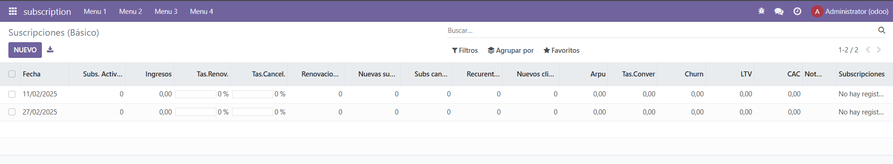

## Segundo Proyecto

```python
# -*- coding: utf-8 -*-

from odoo import models, fields, api # type: ignore


class metrica(models.Model):
    _name = 'subscription.metrica'
    _description = 'subscription.subscription'

    fecha = fields.Date('fecha')
    suscripciones_activas = fields.Integer('suscripciones_activas')
    ingresos = fields.Float()
    tasa_renovacion = fields.Float(compute="_renovaciones")
    tasa_cancelacion = fields.Float(compute="_cancelaciones")
    renovacion = fields.Integer(default=0)
    new_suscripciones = fields.Integer()
    suscripciones_canceladas= fields.Integer()
    cliente_recurrente = fields.Integer()
    cliente_nuevos = fields.Integer()
    ARPU = fields.Float(compute="_calculo_arpu")
    tasa_conversion = fields.Float()
    churn_date = fields.Float()
    LTV = fields.Float()
    CAC = fields.Float()
    notas = fields.Text()
    subscripciones=fields.One2many(
        comodel_name='subscription.subscription',
        inverse_name='name')

    @api.depends('suscripciones_activas','renovacion')
    def _renovaciones(self):
        for record in self:
            if record.suscripciones_activas:
                record.tasa_renovacion = (record.renovacion / record.suscripciones_activas)*100
            else:
                record.tasa_renovacion =0

    @api.depends('suscripciones_canceladas','suscripciones_activas')
    def _cancelaciones(self):
        for record in self:
            if record.suscripciones_activas:
                record.tasa_cancelacion = (record.suscripciones_canceladas / record.suscripciones_activas)*100
            else:
                record.tasa_cancelacion =0
    
    @api.depends('ingresos','suscripciones_activas')
    def _calculo_arpu(self):
        for record in self:
            if record.suscripciones_activas:
                record.ARPU = (record.ingresos / record.suscripciones_activas)
            else:
                record.ARPU =0
```
Cree el modulo con las caracteristicas pedidas
```xml
<odoo>
  <data>
    <!-- explicit list view definition -->
    <record id="view_subscription_metricas" model="ir.ui.view">
      <field name="name">subscription list</field>
      <field name="model">subscription.metrica</field>
      <field name="arch" type="xml">
        <tree editable= 'top'>
           <field name="fecha" string="Fecha"/>
          <field name="suscripciones_activas" string="Subs. Activas"/>
          <field name="ingresos" string="Ingresos"/>
          <field name="tasa_renovacion" string="Tas.Renov."  widget="progressbar"/>
          <field name="tasa_cancelacion" string="Tas.Cancel." widget="progressbar"/>
          <field name="renovacion" string="Renovaciones"/>
          <field name="new_suscripciones" string="Nuevas subs."/>
          <field name="suscripciones_canceladas" string="Subs cancel"/>
          <field name="cliente_recurrente" string="Recurentes"/>
          <field name="cliente_nuevos" string="Nuevos clientes"/>
          <field name="ARPU" />
          <field name="tasa_conversion" string="Tas.Conver"/>
          <field name="churn_date" string="Churn"/>
          <field name="LTV" string="LTV"/>
          <field name="CAC" string="CAC"/>
          <field name="notas" string="Notas"/>
          <field name="subscripciones"/>
        </tree>
      </field>
    </record>


    <record model="ir.actions.act_window" id="action_subscription_metrica">
        <field name="name">Suscripciones (Básico)</field>
        <field name="res_model">subscription.metrica</field>
        <field name="view_mode">tree</field>
        <field name="view_id" ref="view_subscription_metricas"/>
    </record>
  </data>
</odoo>
```
le cree una vista
```python
# -*- coding: utf-8 -*-
{
    'name': "subscription",

    'summary': """
        Short (1 phrase/line) summary of the module's purpose, used as
        subtitle on modules listing or apps.openerp.com""",

    'description': """
        Long description of module's purpose
    """,

    'author': "My Company",
    'website': "https://www.yourcompany.com",

    # Categories can be used to filter modules in modules listing
    # Check https://github.com/odoo/odoo/blob/16.0/odoo/addons/base/data/ir_module_category_data.xml
    # for the full list
    'category': 'Uncategorized',
    'version': '0.1',

    # any module necessary for this one to work correctly
    'depends': ['base'],

    # always loaded
    'data': [
        'security/ir.model.access.csv',
        'views/from.xml',
        'views/tree_basic.xml',
        'views/tree_usage.xml',
        'views/static_web.xml',
        'views/dinamic_web.xml',
        'views/metricas.xml',
        'views/templates.xml',
        'views/menus.xml',
    ],
    # only loaded in demonstration mode
    'demo': [
        'demo/demo.xml',
    ],
}
```

lo llame en el manifest


