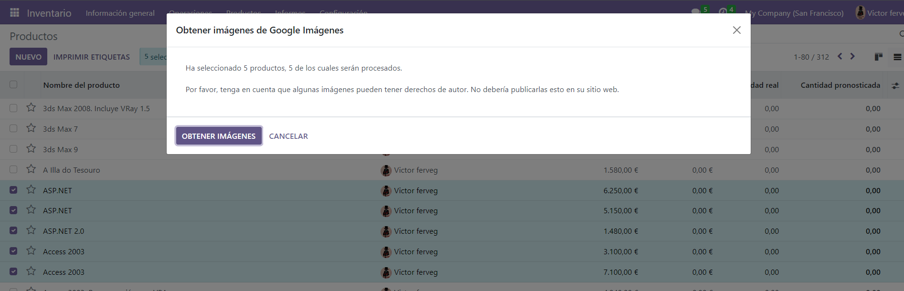
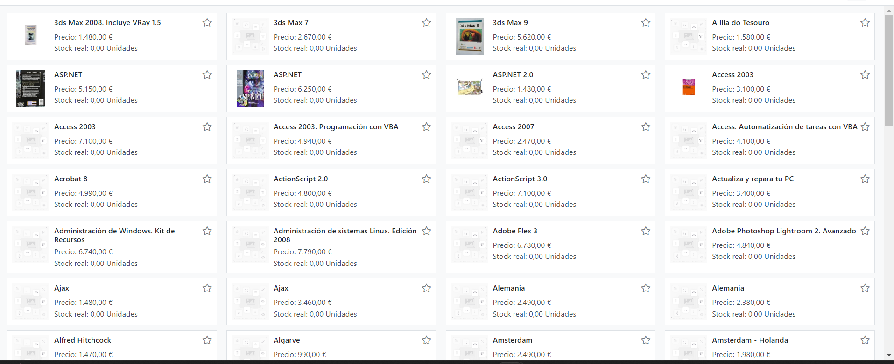

## Inventario

Buscamos el modulo de inventario en area de Aplicaciones 
descargamos el archivo de  productos y  nos vamos al modulo de inventario  y entramos en el apartado de productos le damos a importar registros y adjudicamos los valores necesarios (nombre y codigo de barras) y los añadimos

para poder buscar directamente tenemos que coner el google search api con odoo por lo que accederemos a "google api y servicios" iniciamos sesion con gooogle y creamos un nuevo proyecto le damos "Crear credenciales" y escogemos la opcion "Clave de API MODULO INVENTARIO" y copiamos la clave

Nos vamos al apartado biblioteca y buscamos "Custom Search API" y accedemos a este luego nos vamos a  "Google Programmable Search Dashboard" le asignamos un nombre al buscador y habilitamos el buscar en toda la web y la busqueda segura y la busqueda por imagenes, con esto esta configurado

Ahora le damos a pesonalizar y copiamos el id del buscador tras esto nos vamos a los ajuste de odoo al apartado integracion y seleccionamos la casilla google imagenes y recargamos la pagina una vez recargada nos mostrara dos campos para rellenar con el APi del modulo y el id y recargamos la pagina

