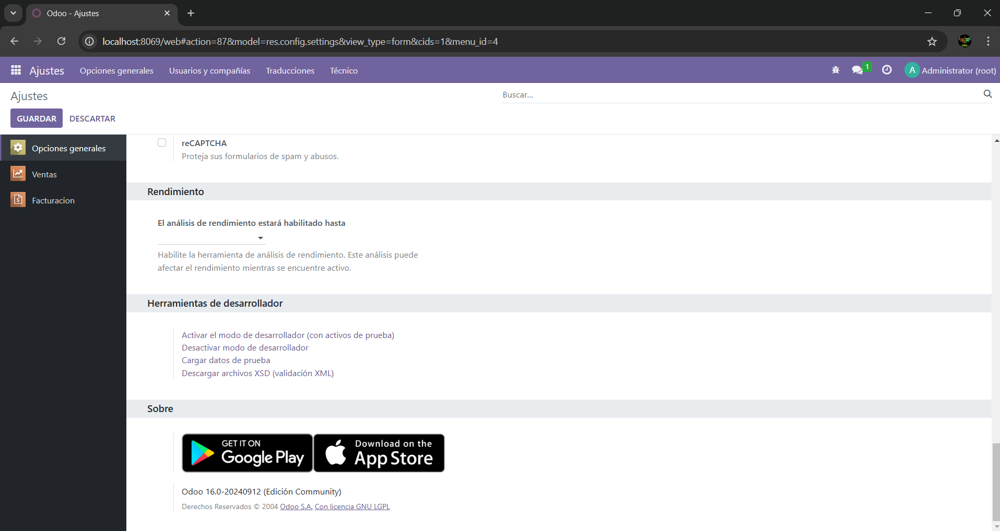
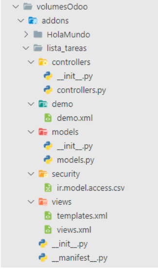
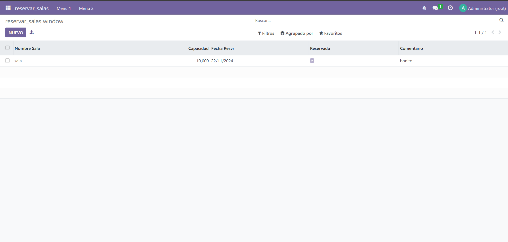
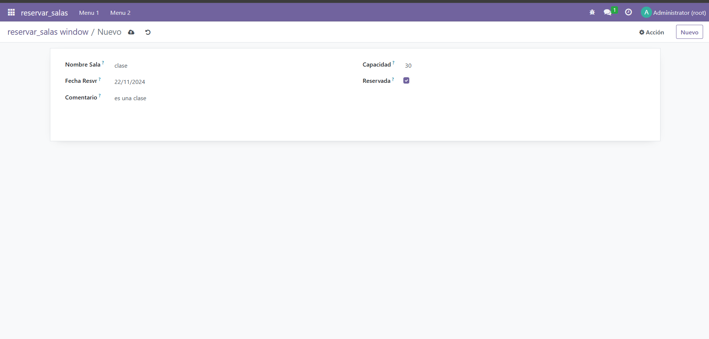
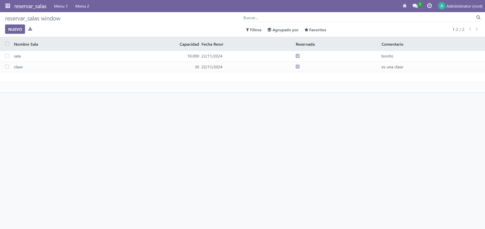

# Creación de un módulo básico

## Primeros pasos

El primer paso es habilitar el modo editor de odoo en ajustes al final del todo en el apartado de "Herramientas de desarrolador"



una vez activado desde el cmd ejecutamos los siguientes comandos:

          docker-compose exec odoo bash

          odoo scaffold "nombre_proyecto" /mnt/extra-addons

Esto genera la siguiente estructura de ficheros



## Creacion del modulo

El primer fichero que se ha de modificar es manifest descomentando la linea 27:

```python 
    # -*- coding: utf-8 -*-
    {
    'name': "reservar_salas",

    'summary': """
        Short (1 phrase/line) summary of the module's purpose, used as
        subtitle on modules listing or apps.openerp.com""",

    'description': """
        Long description of module's purpose
    """,

    'author': "My Company",
    'website': "https://www.yourcompany.com",

    # Categories can be used to filter modules in modules listing
    # Check https://github.com/odoo/odoo/blob/16.0/odoo/addons/base/data/ir_module_category_data.xml
    # for the full list
    'category': 'Uncategorized',
    'version': '0.1',

    # any module necessary for this one to work correctly
    'depends': ['base'],

    # always loaded
    'data': [
        'security/ir.model.access.csv',
        'views/views.xml',
        'views/templates.xml',
    ],
    # only loaded in demonstration mode
    'demo': [
        'demo/demo.xml',
    ],
}

```

El siguiente es el model.py

``` python
    # -*- coding: utf-8 -*-

    from odoo import models, fields, api # type: ignore


    class reservar_salas(models.Model):
        _name = 'reservar_salas.reservar_salas'
        _description = 'reservar_salas.reservar_salas'

        nombre_sala = fields.Char()
        capacidad = fields.Integer()
        fecha_resvr = fields.Date()
        reservada = fields.Boolean()
        comentario = fields.Char()

        

```

y por ultimo el views.xml
``` xml
    <odoo>
    <data>
        <!-- explicit list view definition -->

        <record model="ir.ui.view" id="reservar_salas.list">
        <field name="name">reservar_salas list</field>
        <field name="model">reservar_salas.reservar_salas</field>
        <field name="arch" type="xml">
            <tree>
            <field name="nombre_sala"/>
            <field name="capacidad"/>
            <field name="fecha_resvr"/>
            <field name="reservada"/>
            <field name="comentario"/>
            </tree>
        </field>
        </record>


        <!-- actions opening views on models -->

        <record model="ir.actions.act_window" id="reservar_salas.action_window">
        <field name="name">reservar_salas window</field>
        <field name="res_model">reservar_salas.reservar_salas</field>
        <field name="view_mode">tree,form</field>
        </record>


        <!-- server action to the one above -->

        <record model="ir.actions.server" id="reservar_salas.action_server">
        <field name="name">reservar_salas server</field>
        <field name="model_id" ref="model_reservar_salas_reservar_salas"/>
        <field name="state">code</field>
        <field name="code">
            action = {
            "type": "ir.actions.act_window",
            "view_mode": "tree,form",
            "res_model": model._name,
            }
        </field>
        </record>


        <!-- Top menu item -->

        <menuitem name="reservar_salas" id="reservar_salas.menu_root"/>

        <!-- menu categories -->

        <menuitem name="Menu 1" id="reservar_salas.menu_1" parent="reservar_salas.menu_root"/>
        <menuitem name="Menu 2" id="reservar_salas.menu_2" parent="reservar_salas.menu_root"/>

        <!-- actions -->

        <menuitem name="List" id="reservar_salas.menu_1_list" parent="reservar_salas.menu_1"
                action="reservar_salas.action_window"/>
        <menuitem name="Server to list" id="reservar_salas" parent="reservar_salas.menu_2"
                action="reservar_salas.action_server"/>

    </data>
    </odoo>
```



 