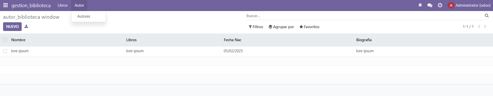

```Python 
#-*- coding: utf-8 -*-

from odoo import models, fields # type: ignore


class gestion_autores(models.Model):
    _name = 'gestion_biblioteca.autor_biblioteca'
    _description = 'gestion_biblioteca.gestion_biblioteca'

    nombre = fields.Char()
    libros = fields.Text()
    fecha_nac = fields.Date()
    biografia = fields.Text()

```
creo el modulo de autores

```Python 
#-*- coding: utf-8 -*-

from odoo import models, fields # type: ignore


class gestion_libros(models.Model):
    _name = 'gestion_biblioteca.libro_biblioteca'
    _description = 'gestion_biblioteca.gestion_biblioteca'

    nombre = fields.Char()
    autor = fields.Char()
    FechaP = fields.Date()
    isbn = fields.Char()
    sinopsis = fields.Text()
```
creo el modulo de libros

```XML
<odoo>
  <data>
    <!--  explicit list view definition  -->
    <record model="ir.ui.view" id="gestion_biblioteca.autor_list">
      <field name="name">gestion_biblioteca list</field>
      <field name="model">gestion_biblioteca.autor_biblioteca</field>
      <field name="arch" type="xml">
        <tree>
          <field name="nombre"/>
          <field name="libros"/>
          <field name="fecha_nac"/>
          <field name="biografia"/>
        </tree>
      </field>
    </record>

    <!--  actions opening views on models  -->

    <record model="ir.actions.act_window" id="gestion_biblioteca.autor_action_window">
      <field name="name">autor_biblioteca window</field>
      <field name="res_model">gestion_biblioteca.autor_biblioteca</field>
      <field name="view_mode">tree,form</field>
    </record>
  </data>
</odoo>
```
conecto la vista del model autor con su respectiva vista

```XML
<odoo>
  <data>
    <!--  explicit list view definition  -->
      <record model="ir.ui.view" id="gestion_biblioteca.libro_list">
        <field name="name">gestion_biblioteca list</field>
        <field name="model">gestion_biblioteca.libro_biblioteca</field>
        <field name="arch" type="xml">
          <tree>
            <field name="nombre"/>
            <field name="autor"/>
            <field name="FechaP"/>
            <field name="isbn"/>
            <field name="sinopsis"/>
          </tree>
        </field>
      </record>

      <!--  actions opening views on models  -->

      <record model="ir.actions.act_window" id="gestion_biblioteca.libro_action_window">
        <field name="name">libro_biblioteca window</field>
        <field name="res_model">gestion_biblioteca.libro_biblioteca</field>
        <field name="view_mode">tree,form</field>
      </record>
    </data>
  </odoo>

  ```
  conecto la vista del model libro con su respectiva vista
  ```XML
  <odoo>
  <data>
  <!--  Top menu item  -->
  <menuitem name="gestion_biblioteca" id="gestion_biblioteca.menu_root"/>
  <!--  menu categories  -->
  <menuitem name="Libros" id="gestion_biblioteca.menu_1" parent="gestion_biblioteca.menu_root"/>
  <menuitem name="Autor" id="gestion_biblioteca.menu_2" parent="gestion_biblioteca.menu_root"/>
  <!--  actions  -->
  <menuitem name="Libros" id="gestion_biblioteca.menu_1_list" parent="gestion_biblioteca.menu_1" action="gestion_biblioteca.libro_action_window"/>
  <menuitem name="Autores" id="gestion_biblioteca" parent="gestion_biblioteca.menu_2" action="gestion_biblioteca.autor_action_window"/>
  </data>
</odoo>
```
conecto las views con los menus

```Python 
# -*- coding: utf-8 -*-
{
    'name': "gestion_biblioteca",

    'summary': """
        Short (1 phrase/line) summary of the module's purpose, used as
        subtitle on modules listing or apps.openerp.com""",

    'description': """
        Long description of module's purpose
    """,

    'author': "My Company",
    'website': "https://www.yourcompany.com",

    # Categories can be used to filter modules in modules listing
    # Check https://github.com/odoo/odoo/blob/16.0/odoo/addons/base/data/ir_module_category_data.xml
    # for the full list
    'category': 'Uncategorized',
    'version': '0.1',

    # any module necessary for this one to work correctly
    'depends': ['base'],

    # always loaded
    'data': [
        'security/ir.model.access.csv',
        'views/autor_biblioteca_views.xml',
        'views/libro_biblioteca_views.xml',
        'views/menu_biblioteca_views.xml',
        'views/templates.xml',
    ],
    # only loaded in demonstration mode
    'demo': [
        'demo/demo.xml',
    ],
}
```
llamo a las distintas views en el manifest


