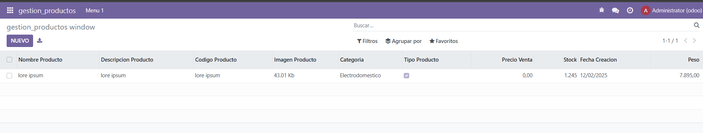

```python
# -*- coding: utf-8 -*-

from odoo import models, fields, api # type: ignore


class gestion_productos(models.Model):
    _name = 'gestion_productos.gestion_productos'
    _description = 'gestion_productos.gestion_productos'

    nombre_producto = fields.Char()
    descripcion_producto = fields.Char()
    codigo_producto = fields.Char(required=True)
    imagen_producto = fields.Binary()
    categoria = fields.Selection(
        [
            ('jardin','Jardin'),
            ('hogar','Hogar'),
            ('electrodomestico','Electrodomestico')
        ]
    )
    tipo_producto = fields.Boolean(help='Es un producto destacable?')
    precio_venta = fields.Float()
    stock = fields.Integer()
    fecha_creacion = fields.Date(default=fields.Date.today)
    peso = fields.Float(digits=(10,2))
      
```
Puse los campos en el model

```XML
<odoo>
    <data>
    <!--  explicit list view definition  -->
    <record model="ir.ui.view" id="gestion_productos.list">
        <field name="name">gestion_productos list</field>
        <field name="model">gestion_productos.gestion_productos</field>
        <field name="arch" type="xml">
            <tree>
                <field name="nombre_producto"/>
                <field name="descripcion_producto"/>
                <field name="codigo_producto"/>
                <field name="imagen_producto"/>
                <field name="categoria"/>
                <field name="tipo_producto"/>
                <field name="precio_venta"/>
                <field name="stock"/>
                <field name="fecha_creacion"/>
                <field name="peso"/>
            </tree>
        </field>
    </record>

    <!--  actions opening views on models  -->
    <record model="ir.actions.act_window" id="gestion_productos.action_window">
        <field name="name">gestion_productos window</field>
        <field name="res_model">gestion_productos.gestion_productos</field>
        <field name="view_mode">tree,form</field>
    </record>

    <menuitem name="gestion_productos" id="gestion_productos.menu_root"/>

    <!--  menu categories  -->

    <menuitem name="Menu 1" id="gestion_productos.menu_1" parent="gestion_productos.menu_root"/>

    <!--  actions  -->

        <menuitem name="List" id="gestion_productos.menu_1_list" parent="gestion_productos.menu_1" action="gestion_productos.action_window"/>
    </data>
</odoo>
```
Conecte el model con la view y le puse los campos a mostrar



