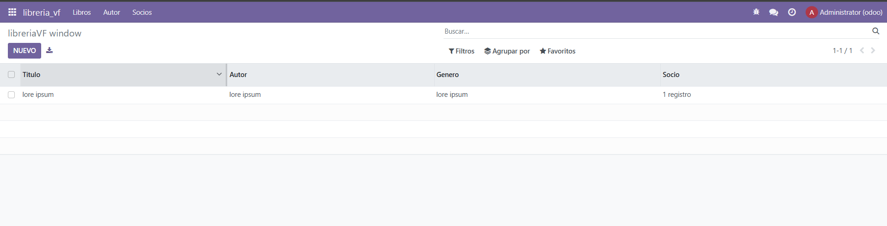
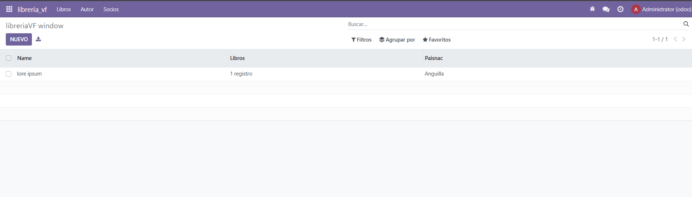
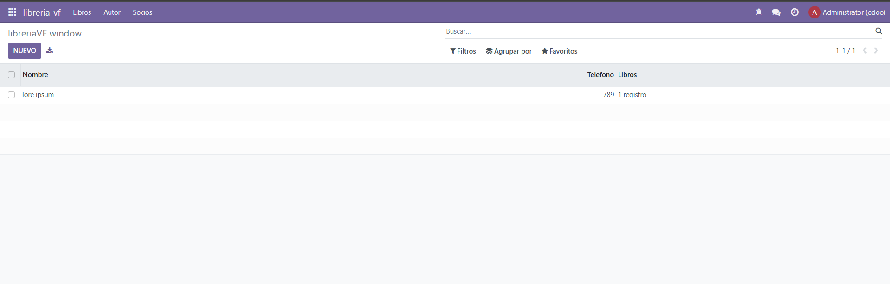

```Python 
# -*- coding: utf-8 -*-

from odoo import models, fields, api # type: ignore


class libreria_autores(models.Model):
    _name = 'libreria_vf.autores'
    _description = 'libreria_vf.libreria_vf'

    name = fields.Char()
    libros = fields.One2many(
        comodel_name='libreria_vf.libros',
        inverse_name='autor')
    paisNac = fields.Many2one (
        comodel_name='res.country',
        ondelete='set null')
```
genero el modulo de autores

```Python 
# -*- coding: utf-8 -*-

from odoo import models, fields, api # type: ignore


class libreria_libros(models.Model):
    _name = 'libreria_vf.libros'
    _description = 'libreria_vf.libreria_vf'

    titulo = fields.Char()
    autor = fields.Many2one (
        comodel_name='libreria_vf.autores',
        ondelete='set null')
    genero = fields.Char()
    socio = fields.Many2many(
            'libreria_vf.socios',
            String='Socios'
            )
```
genero el modulo de libros

```Python 
# -*- coding: utf-8 -*-

from odoo import models, fields, api # type: ignore


class libreria_socios(models.Model):
    _name = 'libreria_vf.socios'
    _description = 'libreria_vf.libreria_vf'

    nombre = fields.Char()
    telefono = fields.Integer()
    libros = fields.Many2many(
            'libreria_vf.libros',
            String='Libros'
            )
```
genero el modulo de socios

```Python 
# -*- coding: utf-8 -*-

from . import libros
from . import autores
from . import socios
```
Los importo en el init

```XML
<odoo>
  <data>
    <!--  explicit list view definition  -->
    <record model="ir.ui.view" id="libreria_vf.autor_list">
    <field name="name">libreriaVF list</field>
    <field name="model">libreria_vf.autores</field>
    <field name="arch" type="xml">
      <tree>
        <field name="name"/>
        <field name="libros"/>
        <field name="paisNac"/>
      </tree>
    </field>
    </record>

    <!--  actions opening views on models  -->

    <record model="ir.actions.act_window" id="libreria_vf.autor_action_window">
      <field name="name">libreriaVF window</field>
      <field name="res_model">libreria_vf.autores</field>
      <field name="view_mode">tree,form</field>
    </record>
  </data>
</odoo>
```
creo la vista de los autores y lo conecto con el modulo

```XML
<odoo>
  <data>
  <!--  explicit list view definition  -->
  <record model="ir.ui.view" id="libreria_vf.libro_list">
    <field name="name">libreriaVF list</field>
    <field name="model">libreria_vf.libros</field>
    <field name="arch" type="xml">
      <tree>
        <field name="titulo"/>
        <field name="autor"/>
        <field name="genero"/>
        <field name="socio"/>
      </tree>
    </field>
  </record>

    <!--  actions opening views on models  -->
    <record model="ir.actions.act_window" id="libreria_vf.libro_action_window">
      <field name="name">libreriaVF window</field>
      <field name="res_model">libreria_vf.libros</field>
      <field name="view_mode">tree,form</field>
    </record>
  </data>
</odoo>
```
creo la vista de los libros y lo conecto con el modulo

```XML 
<odoo>
  <data>
    <!--  explicit list view definition  -->
    <record model="ir.ui.view" id="libreria_vf.socios_list">
      <field name="name">libreriaVF list</field>
      <field name="model">libreria_vf.socios</field>
      <field name="arch" type="xml">
        <tree>
          <field name="nombre"/>
          <field name="telefono"/>
          <field name="libros"/>
        </tree>
      </field>
    </record>
    
    <!--  actions opening views on models  -->
    <record model="ir.actions.act_window" id="libreria_vf.socios_action_window">
      <field name="name">libreriaVF window</field>
      <field name="res_model">libreria_vf.socios</field>
      <field name="view_mode">tree,form</field>
    </record>

  </data>
</odoo>
```
creo la vista de los socios y los conecto con el modulo


``` XML 
<odoo>
  <data>
    <!--  Top menu item  -->
    <menuitem name="libreria_vf" id="libreria_vf.menu_root"/>

    <!--  menu categories  -->
    <menuitem name="Libros" id="libreria_vf.menu_1" parent="libreria_vf.menu_root"/>
    <menuitem name="Autor" id="libreria_vf.menu_2" parent="libreria_vf.menu_root"/>
    <menuitem name="Socios" id="libreria_vf.menu_3" parent="libreria_vf.menu_root"/>

    <!--  actions  -->
    <menuitem name="Libros" id="libreria_vf.menu_1_list" parent="libreria_vf.menu_1" action="libreria_vf.libro_action_window"/>
    <menuitem name="Autores" id="libreria_vf.menu_2_list" parent="libreria_vf.menu_2" action="libreria_vf.autor_action_window"/>
    <menuitem name="Socios" id="libreria_vf.menu_3_list" parent="libreria_vf.menu_3" action="libreria_vf.socios_action_window"/>

  </data>
</odoo>
```
creo la vista de los menus y los conecto con las distintas vistas


```Python 
# -*- coding: utf-8 -*-
{
    'name': "libreriaVF",

    'summary': """
        Short (1 phrase/line) summary of the module's purpose, used as
        subtitle on modules listing or apps.openerp.com""",

    'description': """
        Long description of module's purpose
    """,

    'author': "My Company",
    'website': "https://www.yourcompany.com",

    # Categories can be used to filter modules in modules listing
    # Check https://github.com/odoo/odoo/blob/16.0/odoo/addons/base/data/ir_module_category_data.xml
    # for the full list
    'category': 'Uncategorized',
    'version': '0.1',

    # any module necessary for this one to work correctly
    'depends': ['base'],

    # always loaded
    'data': [
        'security/ir.model.access.csv',
        'views/autor_biblioteca_views.xml',
        'views/libro_biblioteca_views.xml',
        'views/socio_biblioteca_views.xml',
        'views/menu_biblioteca_views.xml',
        'views/templates.xml',
    ],
    # only loaded in demonstration mode
    'demo': [
        'demo/demo.xml',
    ],
}
```
en el manifest llamo a los distintos views



