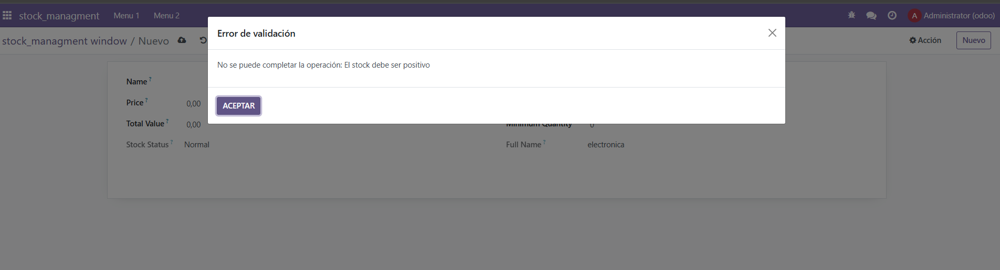
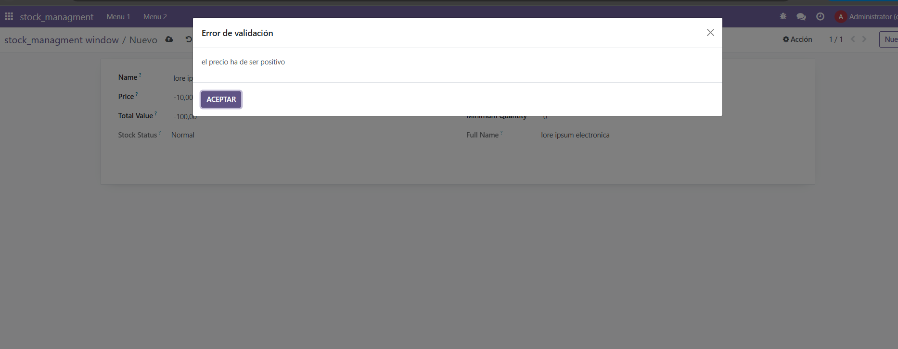
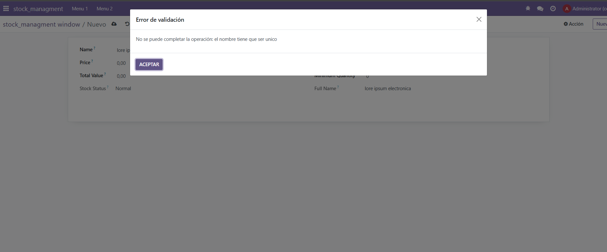
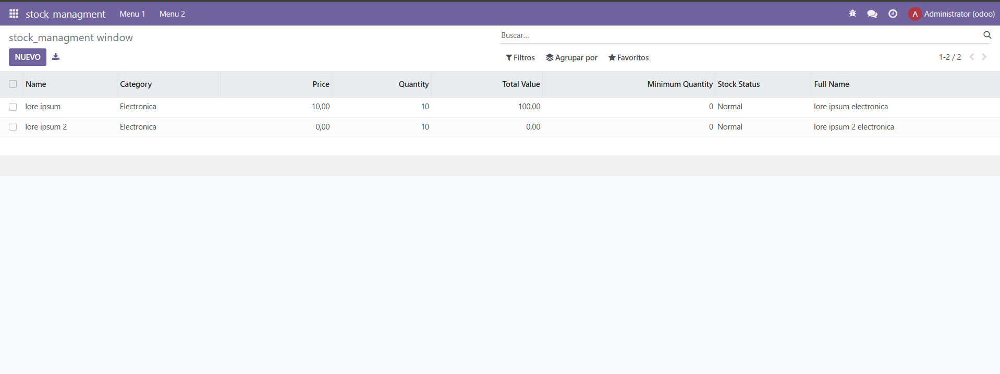

# Campos calculados y restricciones

``` python 
# -*- coding: utf-8 -*-

from odoo import models, fields, api # type: ignore
from odoo.exceptions import  ValidationError # type: ignore


class stock_managment(models.Model):
    _name = 'stock_managment.stock_managment'
    _description = 'stock_managment.stock_managment'
    _sql_constraints=[
        ('unique_name','unique(name)','el nombre tiene que ser unico'),
        ('check_quantity','CHECK(quantity > 0)','El stock debe ser positivo')
    ]

    name = fields.Char()

    category = fields.Selection([
        ('electronica','Electronica'),
        ('ropa','Ropa'),
        ('alimentacion','alimentacion')
    ],
    default='electronica'
    )

    price = fields.Float()
    quantity=fields.Integer()
    total_value = fields.Float(compute="_precio_total", inverse="_inverse_total")
    minimum_quantity = fields.Integer()

    stock_status = fields.Selection([
        ('normal','Normal'),
        ('low','Low Stock')
    ],compute="_stock_status")
    full_name = fields.Char(compute="_full_name")
    
    @api.constrains('price')
    def _check_price(self):
        for record in self:
            if record.price <0:
                raise ValidationError('el precio ha de ser positivo')
            
    @api.constrains('total_value')
    def _check_category(self):
        for record in self:
             if not record.category:
                raise ValidationError('ha de tener un valor')
    
    @api.constrains('total_value')
    def _check_total_value(self):
        for record in self:
            if record.total_value >100000:
                raise ValidationError('el precio toal ha de ser menor a 100000')

    @api.depends('price','quantity')
    def _precio_total(self):
        for record in self:
            record.total_value = float(record.price * record.quantity)

    def _inverse_total(self):
            for record in self:
                if record.quantity !=0:
                    record.price = record.total_value/ record.quantity
    
    @api.depends('minimum_quantity','quantity')
    def _stock_status(self):
        for record in self:
            if(record.quantity<record.minimum_quantity):
                record.stock_status="low"
            else:
                record.stock_status="normal"
    
    @api.depends('name','category')
    def _full_name(self):
        for record in self:
            name = record.name or '' 
            category = record.category or '' 
            record.full_name = name + " " + category
```
creo las distintas restricciones y campos calculados

```xml 
<odoo>
    <data>
        <!--  explicit list view definition  -->
        <record model="ir.ui.view" id="stock_managment.list">
            <field name="name">stock_managment list</field>
            <field name="model">stock_managment.stock_managment</field>
            <field name="arch" type="xml">
                <tree>
                    <field name="name"/>
                    <field name="category"/>
                    <field name="price"/>
                    <field name="quantity"/>
                    <field name="total_value"/>
                    <field name="minimum_quantity"/>
                    <field name="stock_status"/>
                    <field name="full_name"/>
                </tree>
            </field>
        </record>

    <!--  actions opening views on models  -->

        <record model="ir.actions.act_window" id="stock_managment.action_window">
            <field name="name">stock_managment window</field>
            <field name="res_model">stock_managment.stock_managment</field>
            <field name="view_mode">tree,form</field>
        </record>

    <!--  server action to the one above  -->

        <record model="ir.actions.server" id="stock_managment.action_server">
            <field name="name">stock_managment server</field>
            <field name="model_id" ref="model_stock_managment_stock_managment"/>
            <field name="state">code</field>
            <field name="code"> action = { "type": "ir.actions.act_window", "view_mode": "tree,form", "res_model": model._name, } </field>
        </record>

        <!--  Top menu item  -->

        <menuitem name="stock_managment" id="stock_managment.menu_root"/>
        <!--  menu categories  -->

        <menuitem name="Menu 1" id="stock_managment.menu_1" parent="stock_managment.menu_root"/>

        <menuitem name="Menu 2" id="stock_managment.menu_2" parent="stock_managment.menu_root"/>
        <!--  actions  -->

        <menuitem name="List" id="stock_managment.menu_1_list" parent="stock_managment.menu_1" action="stock_managment.action_window"/>
        <menuitem name="Server to list" id="stock_managment" parent="stock_managment.menu_2" action="stock_managment.action_server"/>
        
    </data>
</odoo>

```
conecto la vists al menu





