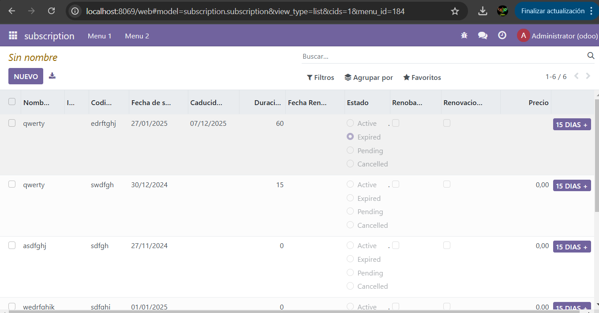
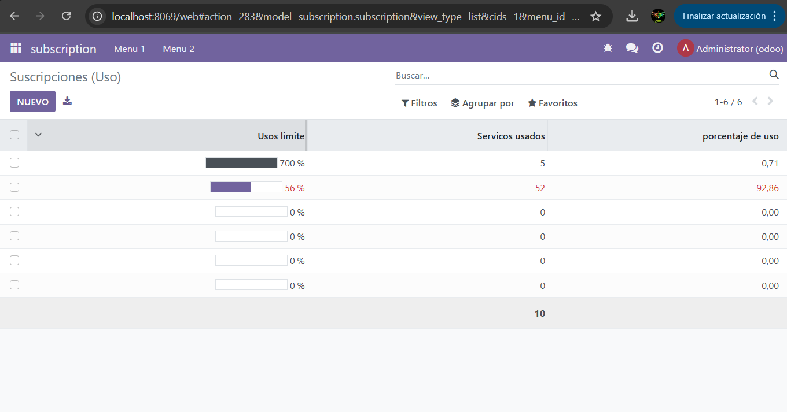

```python
# -*- coding: utf-8 -*-

from odoo import models, fields, api # type: ignore


class subscription(models.Model):
    _name = 'subscription.subscription'
    _description = 'subscription.subscription'
    _sql_constraints=[
        ('unique_code','unique(subscription_code)','el codigo tiene que ser unico'),
    ]

    name = fields.Char(required=True)
    #Campos básicos
    customer_id = fields.Many2one (
        comodel_name='res.partner',
        ondelete='set null',
        #required=True
        )
    subscription_code = fields.Char(required=True)
    start_date = fields.Date(required=True)
    end_date = fields.Date()
    duration_months = fields.Integer()
    renewal_date = fields.Date()
    status = fields.Selection([
        ('active','Active'),
        ('expired','Expired'),
        ('pending','Pending'),
        ('cancelled','Cancelled')
    ])
    is_renewable = fields.Boolean()
    auto_renewal = fields.Boolean()
    price = fields.Float()
    #Campos de uso
    usage_limit = fields.Integer()
    current_usage = fields.Integer()
    use_percent = fields.Float(compute='_percent')

    @api.depends('usage_limit','current_usage')
    def _percent(self):
        for record in self:
            if record.usage_limit:  # Avoid division by zero
                record.use_percent = (record.current_usage / record.usage_limit) * 100
            else:
                record.use_percent = 0

 
    def mas_dia(self):
         self.duration_months = self.duration_months+15
```
genero los campos con las carcteristicas necesarias

```XML 
<odoo>
  <data>
    <!-- explicit list view definition -->

    <record id="view_subscription_tree_basic" model="ir.ui.view">
      <field name="name">subscription list</field>
      <field name="model">subscription.subscription</field>
      <field name="arch" type="xml">
        <tree limit="15" decoration-danger="status=='expired'" decoration-warning="status=='cancelled'">
          <field name="name" string="Nombre"/>
          <field name="customer_id" string="ID"/> 
          <field name="subscription_code" string="Codigo"/> 
          <field name="start_date" string="Fecha de subscripcion"/>
          <field name="end_date"  string="Caducidad" widget="remaining_days"/>
          <field name="duration_months" string="Duracion"/>
          <field name="renewal_date" string="Fecha Renovacion"/>
          <field name="status"  string="Estado" widget="radio"/>
          <field name="is_renewable"  string="Renobable"/>
          <field name="auto_renewal" string="Renovacion automatica"/>
          <field name="price" string="Precio" attrs="{'invisible':[('status', '=', 'expired')]}"/>
          <button name="mas_dia" type="object" string="15 dias +" class="oe_highlight"/>
        </tree>
      </field>
    </record>

    <!-- actions opening views on models -->
    <record id="action_subscription_basic" model="ir.actions.act_window">
        <field name="name">Suscripciones (Básico)</field>
        <field name="res_model">subscription.subscription</field>
        <field name="view_mode">tree,form</field>
        <field name="view_id" ref="view_subscription_tree_basic"/>
    </record>

  </data>
</odoo>
```
genero la vista de los campos basicos
```xml
<odoo>
  <data>
    <!-- explicit list view definition -->
    <record id="view_subscription_tree_usage" model="ir.ui.view">
      <field name="name">subscription list</field>
      <field name="model">subscription.subscription</field>
      <field name="arch" type="xml">
        <tree limit="15" decoration-danger="use_percent>80">
          <field name="usage_limit"  string="Usos limite" widget="progressbar"/>
          <field name="current_usage" string="Servicos usados" avg="1"/>
          <field name="use_percent" string="porcentaje de uso"/>
        </tree>
      </field>
    </record>


    <record id="action_subscription_usage" model="ir.actions.act_window">
        <field name="name">Suscripciones (Uso)</field>
        <field name="res_model">subscription.subscription</field>
        <field name="view_mode">tree,form</field>
        <field name="view_id" ref="view_subscription_tree_usage"/>
    </record>


  </data>
</odoo>
```
genero la vista de los campos de uso
```xml
<odoo>
  <data>
    
    <!-- Top menu item -->

    <menuitem name="subscription" id="subscription.menu_root"/>

    <!-- menu categories -->

    <menuitem name="Menu 1" id="subscription.menu_1" parent="subscription.menu_root"/>
    <menuitem name="Menu 2" id="subscription.menu_2" parent="subscription.menu_root"/>


    <!-- actions -->

    <menuitem name="Basic" id="subscription.menu_1_list" parent="subscription.menu_1"
              action="action_subscription_basic"/>
    <menuitem name="Usage" id="form" parent="subscription.menu_2"
              action="action_subscription_usage"/>


  </data>
</odoo>
```
conecto los views por medio de los menus

```python
# -*- coding: utf-8 -*-
{
    'name': "subscription",

    'summary': """
        Short (1 phrase/line) summary of the module's purpose, used as
        subtitle on modules listing or apps.openerp.com""",

    'description': """
        Long description of module's purpose
    """,

    'author': "My Company",
    'website': "https://www.yourcompany.com",

    # Categories can be used to filter modules in modules listing
    # Check https://github.com/odoo/odoo/blob/16.0/odoo/addons/base/data/ir_module_category_data.xml
    # for the full list
    'category': 'Uncategorized',
    'version': '0.1',

    # any module necessary for this one to work correctly
    'depends': ['base'],

    # always loaded
    'data': [
        'security/ir.model.access.csv',
        'views/tree_basic.xml',
        'views/tree_usage.xml',
        'views/menus.xml',
        'views/templates.xml',
    ],
    # only loaded in demonstration mode
    'demo': [
        'demo/demo.xml',
    ],
}
```
llamo a los views desde el manifest



