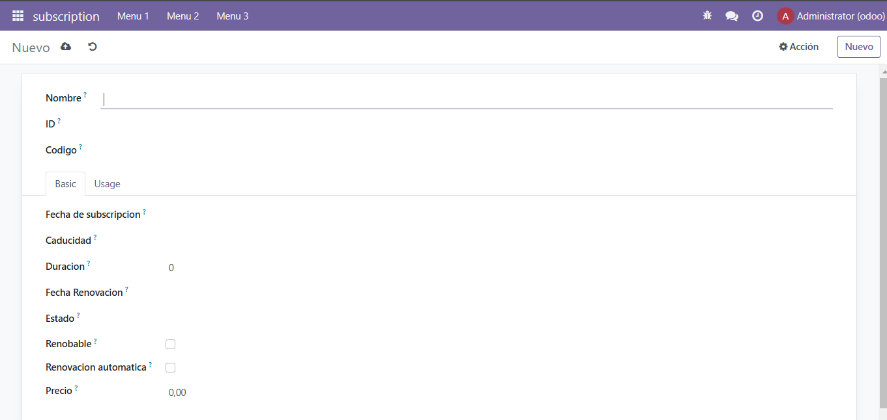
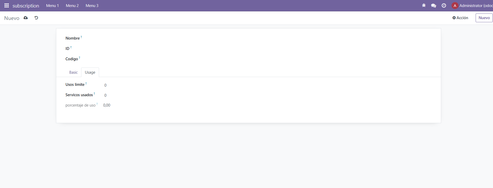

``` xml
<odoo>
  <data>
    <!-- explicit list view definition -->

    <record id="view_subscription_form_basic" model="ir.ui.view">
      <field name="name">subscription list</field>
      <field name="model">subscription.subscription</field>
      <field name="arch" type="xml">
        <form string='aaa'>
            <sheet>
                <group>

                    <field name="name" string="Nombre"/>

                    <field name="customer_id" string="ID"/> 

                    <field name="subscription_code" string="Codigo"/>
                </group>
                <!-- <group> -->
                    <notebook>
                        <page string="Basic">
                            <group>
                                <field name="start_date" string="Fecha de subscripcion"/>
                                <field name="end_date"  string="Caducidad"/>
                                <field name="duration_months" string="Duracion"/>
                                <field name="renewal_date" string="Fecha Renovacion"/>
                                <field name="status"  string="Estado"/>
                                <field name="is_renewable"  string="Renobable"/>
                                <field name="auto_renewal" string="Renovacion automatica"/>
                                <field name="price" string="Precio"/>
                            </group>
                        </page>
                        <page string="Usage">
                            <group>
                                <field name="usage_limit"  string="Usos limite" />
                                <field name="current_usage" string="Servicos usados"/>
                                <field name="use_percent" string="porcentaje de uso"/>
                            </group>
                        </page>
                    </notebook>
                <!-- </group>   -->
            </sheet>
        </form>
      </field>
    </record>


    <!-- actions opening views on models -->
    
    
    <record id="action_subscription_form_basic" model="ir.actions.act_window">
        <field name="name">Suscripciones (Básico)</field>
        <field name="res_model">subscription.subscription</field>
        <field name="view_mode">tree,form</field>
        <field name="view_id" ref="view_subscription_form_basic"/>
    </record>
  </data>
</odoo>
```
genero la vista de tipo form

```python
# -*- coding: utf-8 -*-
{
    'name': "subscription",

    'summary': """
        Short (1 phrase/line) summary of the module's purpose, used as
        subtitle on modules listing or apps.openerp.com""",

    'description': """
        Long description of module's purpose
    """,

    'author': "My Company",
    'website': "https://www.yourcompany.com",

    # Categories can be used to filter modules in modules listing
    # Check https://github.com/odoo/odoo/blob/16.0/odoo/addons/base/data/ir_module_category_data.xml
    # for the full list
    'category': 'Uncategorized',
    'version': '0.1',

    # any module necessary for this one to work correctly
    'depends': ['base'],

    # always loaded
    'data': [
        'security/ir.model.access.csv',
        'views/from.xml',
        'views/tree_basic.xml',
        'views/tree_usage.xml',
        'views/menus.xml',
        'views/templates.xml',
    ],
    # only loaded in demonstration mode
    'demo': [
        'demo/demo.xml',
    ],
}
```
llamo al view en el manifest


