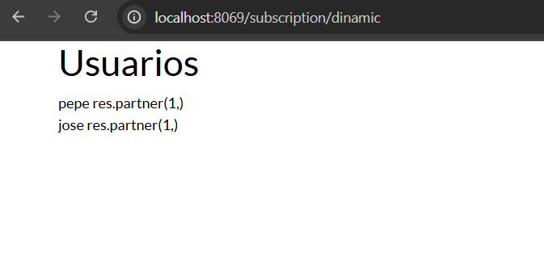
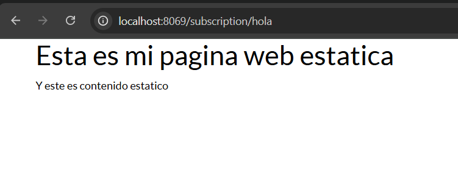

```python
# -*- coding: utf-8 -*-
from odoo import http # type: ignore


class Subscription(http.Controller):
    @http.route('/subscription/hola',type='http', auth='public',website=True)
    def static(self, **kw):
        return http.request.render('subscription.static_web',{})
    
    @http.route('/subscription/dinamic',type='http', auth='public',website=True)
    def dinamica(self, **kw):
        data = http.request.env['subscription.subscription'].search([]) 
        return http.request.render('subscription.dinamic_web',{'data':data})
```
creo los controlers de ambas paginas
```xml
<?xml version="1.0" encoding="utf-8"?>
<odoo>
    <template id="static_web" name="pagina estatica">
        <t t-call="web.html_container">
            <div class="container">
                <h1>Esta es mi pagina web estatica</h1>
                <p>Y este es contenido estatico</p>
            </div>
        </t>
    </template>
</odoo>
```
creo la vista de la pagina statica
```xml
<?xml version="1.0" encoding="utf-8"?>
<odoo>
    <template id="dinamic_web" name="pagina dinamica">
        <t t-call="web.html_container">
            <div class="container">
                <h1>Usuarios</h1>
                <t t-foreach="data" t-as="data">
                    <div class="data">
                        <spam><t t-esc="data.name"/></spam>
                        <spam><t t-esc="data.customer_id"/></spam>
                    </div>
                </t>
            </div>
        </t>
    </template>
</odoo>
```
creo la vista de la pagina dinamica 



