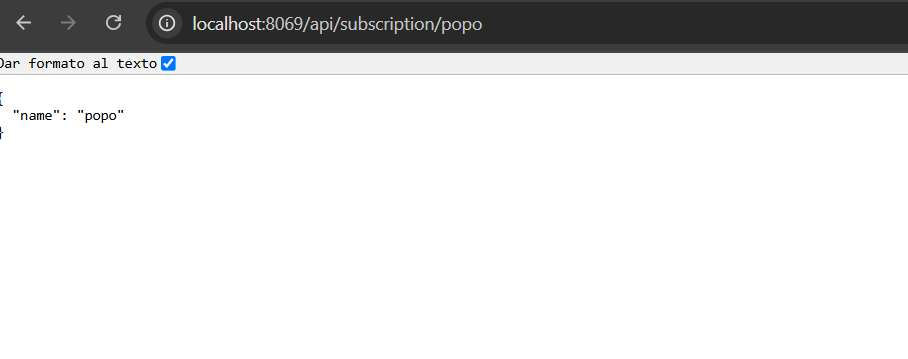

# API REST

```python
# -*- coding: utf-8 -*-
from odoo import http # type: ignore
from odoo.http import request, Response # type: ignore
import json

class MyController(http.Controller):

    @http.route('/api/subscription/<string:name>', type='http', methods=['GET'], csrf=False, auth='none')
    def index(self, name):
        try:
            data = request.env['subscription.subscription'].sudo().search([('name', '=', name)], limit=1)
            
            if not data:
                return Response(
                    json.dumps({'msg': 'Nombre no encontrado'}),
                    content_type="application/json",
                    status=404
                )

            result = {
                "name": data.name  # Asegurar que solo accedemos a un registro
            }
            
            return Response(
                json.dumps(result),
                content_type="application/json",
                status=200
            )

        except Exception as e:
            return Response(
                json.dumps({'msg': f"Error interno del servidor: {str(e)}"}),
                content_type="application/json",
                status=500
            )

    @http.route('/api/subscription/', type='http', methods=['GET'], csrf=False, auth='none')
    def api_query(self):
        try:
            status = request.params.get('status')
            if status:
               subs = request.env['subscription.subscription'].sudo().search([('status','=',status)])
            else:
               subs = request.env['subscription.subscription'].sudo().search()
            data=[
                {"name": subs.name, "status":subs.status}
                for subs in subs
            ]
            return Response(
                json.dumps(data),
                content_type="application/json",
                status=200
            )

        except Exception as e:
            return Response(
                json.dumps({'msg': f"Error interno del servidor: {str(e)}"}),
                content_type="application/json",
                status=500
            )
```

creo los controladores de las apis



